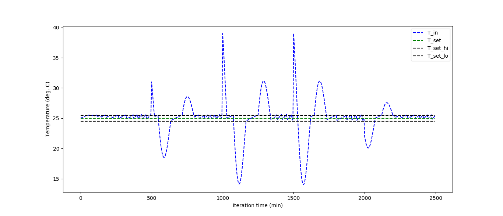
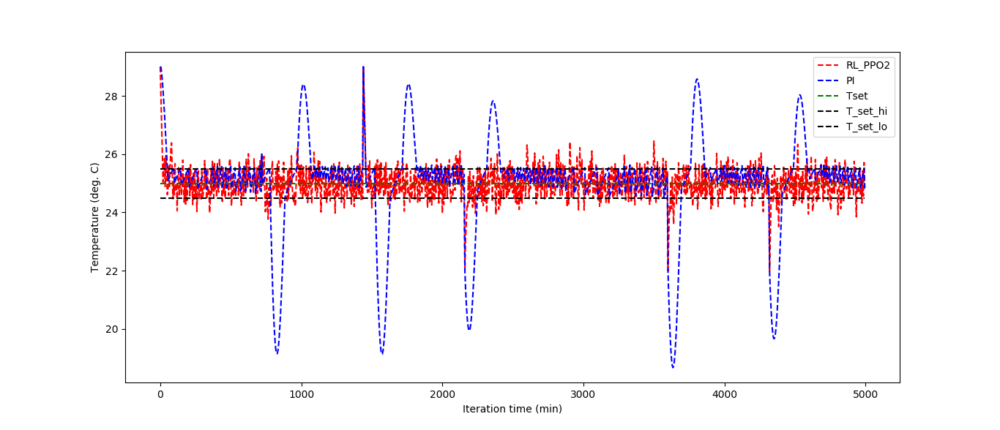
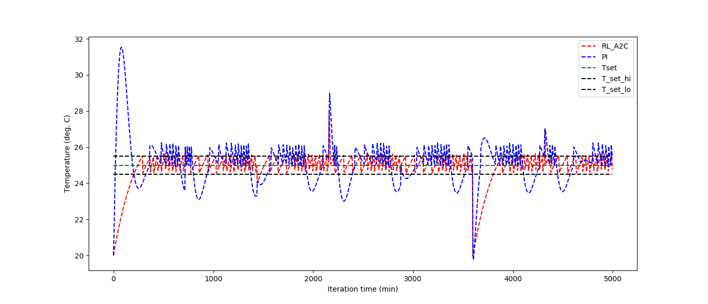

# Thermal HVAC Model

## Objective
The aim of this project is to model an environment room and maintain its inside temperature within a given threshold by controlling the amount of heat to or from the system using two different methods: a) classical Proportional Integral (PI) controller, b) Reinforcement Learning methods.

Results show that the Reinforcement Learning method outperforms the classical PI controller.

## Thermal Environment 
The thermal envrionment is represented by a lumped-capacitance model following the 1st law of thermodynamics based on conservation of evergy for a stationary closed system: 
$ Q _in_ - Q _AC_ = Delta _E_ $. 
For cooling, Q_AC is the amount of energy taken from the system, Q_in is the heat transfered by conduction through the walls. Delta _E_ is the internal energy change in terms of mass, specific heat at constant volume and the internal change in temperature. The equation works for both heating or cooling of the room depending the outside and inside setting temperatures.

## Assumptions
The heat generation by appliances inside the room, and the convection and radiation heat transfer modes are omitted for simplicity in the equation.

## Equation of State

$ d/dt(Q _in_ - Q _AC_)= d/dt (Delta _E_) $.

d/dt (Q _in_) = \frac {-KA.d/dt(T _in_ - T _out_)} {thickness}

Delta _E_ = C _v_ . d/dt(m . (T _in_ - T _in_(t-1))

Q _AC_ = Constant

T _in_ (t) = T _in_ (t-1) - C _v_.(dt/m)*(KA ((T _in_ (t-1) - T_ out) + (Q _AC_))

dt = timestep(sec) = control step

## PI Controller

The PI controller is a closed-loop system composed of a proportional and integral blocks to reduce the amount of error and stabilize the inside temperature within the offset. The error is the difference between the inside temperature and the set point with an accepted offset of 0.1 deg.C. For the P controller, the gain is multiplied to the instantanuous error whereas the integral gain is multiplied by the sum of the errors accumulated during the iteration loop. During iteration, if the absolute error is greater than the offset the action will be to multiply the total control_signal = p_controller(error) + I_controller(errorI) with the Q_AC and modify the equation of state to update the T_in. The proportional and integrate gain factors have been tuned manually to reach the desired offset at steady state temperature.  More detail are provided in the code AC_room.py.

## Reinforcement Learning
This is a model-free RL problem as we are using a simulator (AC_Room.py). In RL the controller is made through the agent. The agent makes an action based on a set of provided choices by changing the amount of heat (ON/OFF/No Action) that modifies the state of the environment (equation of state) and receives a reward based on the reward function to imrove its next actions at every control step or itiration. The objective is to maximize the reward function (or minimize the cost function). The observations (or error herein) are sent back to a neural network to better train the model at the end of each episode.

The custom made environment "AC_room.py" has been adapted to the OpenAI Gym environment and algorithms from Stable Baseline were used to train the thermal model. 

### PPO2 algorithm:
The PPO2 is an On Policy and well known algorithm that uses the current inputs and not the previously learned data for model optimization. The action is selected from a box of continuous float numbers between -1 to 1. The number of observation is 1 and refers to the error (difference between the inside temperature and the set point). The reward is a function of error, if the error is 0 with an accepted offset of 0.5 degC the agent receives a maximum reward of 1 and the reward decreases exponentioaly with errors greater than 0.5.
Based on the observation and the reward function the agent optimizes its action [-1, 1] every 5 minutes for 24 hours which is fed to the Update inside temperature function in the AC_room.py Room class to get a new set of states of the environment (T_in).
Since the PPO2 default policy uses a very large number of neurons and hidden layer (3 layers of size 128 each), a custom policy was adapted in this simple problem to reduce to (2 layers of size 8 each) and this improved the performance by reducing the oscillation at the steady state by about a factor of 2. 

### A2C algorithm:
A2C is a simpler algorithm in comparison to PPO2. The actions are discrete numbers (-1, 0, 1) corresponding to (removes heat, no action, max heat). The same reward function as in PPO2 is used. 

# Files

## AC_room.py 
This file contains the thermal environment class Room with the PI Controller and generates the plot of inside temperature (T_in) as a function of iteration time in (min) and the set temperature.

> python AC_room.py

## gym_room.py

This file provides the OpenAI gym environment of the model in AC_room.py. It uses the reinforcement learning PPO2 algorithm from the Stable Baseline to train the model and maintain the inside temperature wihtin the limits.

Argparse has been used to define the mode train or predict: 

To **_train_** this model use the following command:

> python gym_room.py --mode "tain"

To **_predict_** the model use the following command:

> python gym_room.py --mode "predict"

It plots the graph of T_in and T_set as a function of iteration time and compares the RL PPO2 result with the PI controller.

The number of timesteps for training can be readjusted by tuning the "total_timesteps" parameter. the 

## gym_room_discrete.py

In this file A2C algorithm from Stable Baseline is used. The output shows the plot of inside temperature and the set point as a function of iteration time for RL and PI controllers.
The RL is a more robust controller as it is seen in the results.

To **_train_** this model use the following command:

> python gym_room_discrete.py --mode "tain"

To **_predict_** the model use the following command:

> python gym_room_discrete.py --mode "predict"

